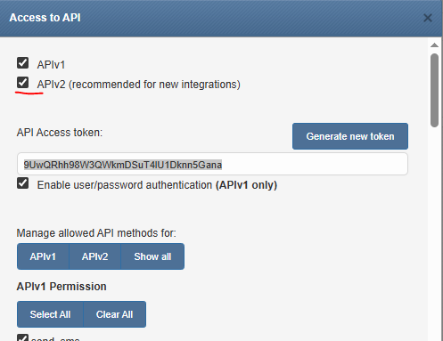
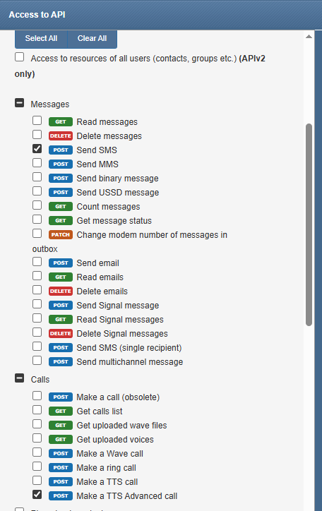
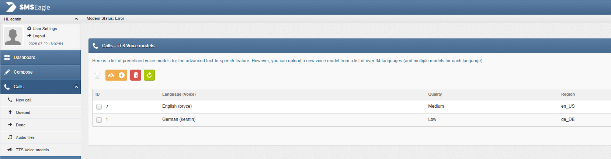

# Notifications Configuration

Send SMS to Teltonika devices, or sms/phone calls via [seven.io](https://seven.io/)

---

#### Access the Configuration Page

- **Open your AXIS camera’s web interface:**  
  Navigate to the camera’s IP address using your preferred web browser.
- **Go to the APP Section:**  
  In the web interface, locate and click on the APP section.
- **Enable Notifications:**  
  Find **Missing Feature ACAP**, open it, and enable the **Notifications** from the feature list. This will launch its configuration panel.

---

#### Configure the Teltonika SMS

- **Url:**  
  Enter the URL of your Teltonika router, like https://192.168.1.50
- **Username:**  
  Enter the username that to connect to the router.
- **Password:**  
  Provide the corresponding password for the specified username.
- **Message:**  
  Specify text that should be send as SMS.
- **Phone Numbers:**  
  A list of phone numbers in full format with leading zeros like: 00436763151474
- **Trigger Event:**  
  Choose the event that will trigger the sending of SMS.
- **Event Timeout:**  
  Timeout after event to prevent multiple notifications in a short time.

---

#### Configure the Seven SMS

- **API Key:**  
  Enter your API key, that you created on [seven.io](https://seven.io/) developer section.
- **Message:**  
  Specify text that should be send as SMS.
- **From Number:**  
  Enter a verified phone number, that you have added trough [seven.io](https://seven.io/) Account/Settings/Sender identifiers.
- **Phone Numbers:**  
  A list of phone numbers in full format with leading zeros like: 00436763151474
- **Trigger Event:**  
  Choose the event that will trigger the sending of SMS.
- **Event Timeout:**  
  Timeout after event to prevent multiple notifications in a short time.

---

#### Configure the Seven Voice

- **API Key:**  
  Enter your API key, that you created on [seven.io](https://seven.io/) developer section.
- **Message:**  
  Specify text that should be played trough the phone call.
- **From Number:**  
  Enter a verified phone number, that you have added trough [seven.io](https://seven.io/) Account/Settings/Sender identifiers.
- **Phone Numbers:**  
  A list of phone numbers in full format with leading zeros like: 00436763151474
- **Trigger Event:**  
  Choose the event that will trigger the call.
- **Event Timeout:**  
  Timeout after event to prevent multiple notifications in a short time.

#### Configure the SMS Eagle (Voice, SMS)

Before you can use the SMS Eagle device, you must enable APIv2 and obtain an API token via the SMS Eagle web interface.

API permissions must also be set up.

Voice ID for calls

- **API Key:**  
  Enter your API key.
- **Message:**  
  Specify text that should be played trough the phone call or send via SMS.
- **Phone Numbers:**  
  A list of phone numbers in full format with leading zeros like: 00436763151474
- **VoiceId:**  
  Corresponding voice ID when using a voice call.
- **Trigger Event:**  
  Choose the event that will trigger the sending of SMS.
- **Event Timeout:**  
  Timeout after event to prevent multiple notifications in a short time.

---

!!! warning "Test" 
    Before test you need to save the configuration.

#### Save the Configuration

- **Save:**  
  Once you have entered all required settings, click **Save** to apply the configuration.

