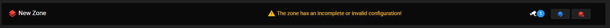
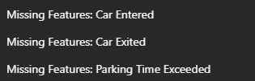

# Parking Times

The Parking Times feature tracks vehicle parking duration using license plate recognition (LPR) events from AXIS cameras. It monitors how long vehicles remain parked and can trigger alerts when parking time limits are exceeded.

---

## Overview

The Parking Times feature:

- Tracks vehicle entry and exit times via LPR events
- Calculates parking duration in real-time
- Alerts when maximum parking time is exceeded
- Supports multiple parking zones with different cameras
- Provides live monitoring via WebSocket

---

## Configuration

### Basic Settings

| Setting | Description |
|---------|-------------|
| **Max Parking Duration** | Maximum allowed parking time in minutes (2-10080, i.e., up to 7 days) |
| **LPR Event Types** | Select which LPR events to process (New, Update, Lost) |

### LPR Event Types

| Event Type | Description |
|------------|-------------|
| **New** | First detection of a license plate |
| **Update** | Correction or direction update for a tracked plate |
| **Lost** | Plate has left the camera's view (includes exit direction) |

### Auto-Removal Settings

| Setting | Description |
|---------|-------------|
| **Auto-Removal** | How long to keep plate records before automatic deletion (4-10080 minutes) |
| **Use Delete Event** | Enable event-triggered deletion instead of time-based |
| **Delete Event** | Configure the external event that triggers deletion |

### List Filtering

| Setting | Description |
|---------|-------------|
| **Only process plates from list** | Enable to filter plates by list name |
| **List Name** | Name of the license plate list to filter by (e.g., "Allow list") |

---

## Parking Zones

Create multiple parking zones to organize cameras by area:

### Zone Configuration

Each zone contains one or more cameras:

| Setting | Description |
|---------|-------------|
| **Zone Name** | Descriptive name for the parking area |
| **Cameras** | List of cameras monitoring this zone |

### Camera Settings

| Setting | Description |
|---------|-------------|
| **Camera Name** | Descriptive name for the camera |
| **IP Address** | IP address of the AXIS camera with LPR |
| **Username** | Camera login username |
| **Password** | Camera login password |
| **Use HTTPS** | Enable secure connection |
| **Role** | Entry, Exit, or Entry and Exit |
| **Is Internal** | Use local device events (for same-device LPR) |

### Camera Roles

| Role | Description |
|------|-------------|
| **Entry** | Camera at parking entrance |
| **Exit** | Camera at parking exit |
| **Entry and Exit** | Single camera monitoring both directions |

---

## Real-Time Monitor

The Monitor panel displays live parking data:

### Monitor Columns

| Column | Description |
|--------|-------------|
| **License Plate** | The detected plate number |
| **Entry Time** | When the vehicle entered |
| **Exit Time** | When the vehicle exited (if applicable) |
| **Zone** | The parking zone name |
| **Camera** | The camera that detected the plate |
| **Parking Duration** | Time parked in minutes (with progress bar) |
| **Exited** | Whether the vehicle has left |
| **Parking Time Exceeded** | Warning indicator if over limit |

### Monitor Controls

| Control | Description |
|---------|-------------|
| **Pause/Play** | Freeze/resume live updates |
| **Filter Exceeded** | Show only vehicles exceeding parking time |
| **Search** | Filter by license plate |

---

## Events

The feature generates AXIS platform events:

- **Parking Time Exceeded**: Triggered when a vehicle exceeds the maximum parking duration
- Can be used in AXIS rules or consumed by other applications

---

## Troubleshooting

| Issue | Solution |
|-------|----------|
| Plates not detected | Verify LPR is running on the camera and events are enabled |
| Wrong entry/exit times | Check camera role configuration (Entry vs Exit) |
| Duplicate entries | Ensure cameras aren't configured in multiple zones |
| Events not triggering | Verify event topic paths match your LPR application |
